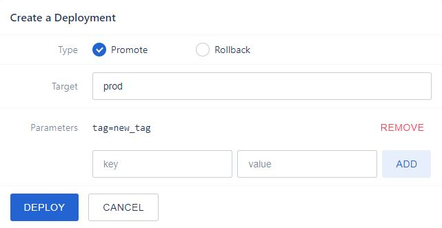

# Drone kustomize plugin
Kustomize plugin for Drone CI.

# Build Status
[](https://drone.m5.run/magna5/drone-k8s-kustomize)

# Usage
```
steps:
  - name: deploy
    image: ghcr.io/magna5/k8s-kustomize
    settings:
      image: ghcr.io/magna5/circuit-inventory-service-api
      cluster: 'M5-Automation'
      cluster_rg: 'Servers_Prod_Central1'
      azure_appid:
        from_secret: azure_appid
      azure_password:
        from_secret: azure_password
      azure_tenant:
        from_secret: azure_tenant
      folderpath: deploy/overlays/production
      debug: true
      dryrun: true

```

Above step can be used for deploying an application which has k8s resource definitions in Kustomize format.
Configuration

| Field      |                 Description                  | Optional | Defaults |
| :--------- | :------------------------------------------: | :------: | :------: |
| image      |           an image to be deployed            |    no    |          |
| kubeconfig |   kubeconfig as a secret in drone secrets    |    no    |          |
| folderpath | a path where kustomization.yaml can be found |    no    |          |
| debug      |       print commands and their output        |   yes    |  false   |
| dryrun     |       print kustomization build output       |   yes    |  false   |

# Hack the Image Tag
In order to override the `DRONE_SEMVER`, one can specify `tag` while invoking the deployment as shown in below image


